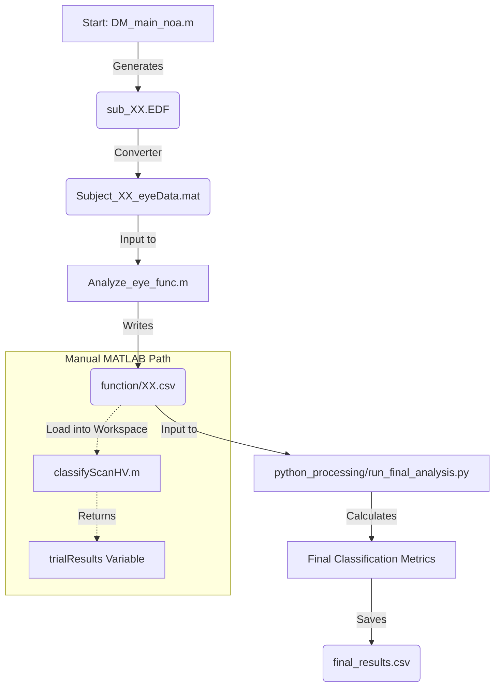

# Project Architecture

This document outlines the structure and functionality of the Thesis EyeTracking project. The project is designed to run a "Variable Attribute Decision-Making Task" using Psychtoolbox and EyeLink, and subsequently process and analyze the eye-tracking data using a hybrid MATLAB/Python pipeline.

## System Overview

1.  **Experiment**: Written in MATLAB (Psychtoolbox). runs the decision-making task, communicates with the EyeLink eye tracker, and saves raw data (`.EDF`) and behavioral data (`.mat`).
2.  **Data Conversion**: `.EDF` files are converted to `.mat` structures (containing `edfStruct`) using `edfmex`.
3.  **Primary Analysis (MATLAB)**: The `Analyze_eye_func.m` function maps raw gaze coordinates to specific Areas of Interest (AOIs) blocks (Header, Attributes, Alternatives) to generate a sequence of fixations.
4.  **Secondary Analysis (Python)**: Python scripts automate the MATLAB analysis (via `matlab.engine`) and perform higher-level movement analysis (Horizontal vs. Vertical transitions) to classify decision strategies.

## Directory Structure

```graphql
Thesis_EyeTracking/
a"|
+-- 01_Experiment/          # Main experiment code (Psychtoolbox)
|   +-- DM_main_noa.m       # ENTRY POINT: Main experiment script
|   +-- instructions/       # Images for instructions
|   +-- Sub_*.mat           # Behavioral results files
|
+-- Eyedata/                # Raw and Intermediate Data storage
|   +-- sub_*.EDF           # Raw EyeLink data
|   +-- Subject_*_eyeData.mat # Converted EyeLink data (edfStruct)
|
+-- python_processing/      # Python analysis pipeline
|   +-- process_eye_data.py # ENTRY POINT: Batch processing script
|   +-- analyze_movements.py# Library for scanpath/transition analysis
|   +-- validation.ipynb    # Jupyter notebook for data validation
|   +-- requirements.txt    # Python dependencies
|
+-- function/               # Output directory for analysis CSVs
+-- Analyze_eye_func.m      # Core MATLAB analysis logic (converts gaze to AOIs)
+-- Analyze_eye_func_v2.m   # Version 2 of analysis logic
+-- classifyScanHV.m        # Helper for classifying search patterns
+-- main.py                 # Placeholder script
+-- README.md               # Project documentation
```

## Key Files & Modules

### 1. Experiment (`01_Experiment/`)

*   **`DM_main_noa.m`**: The heart of the data collection.
    *   **Setup**: Initializes Psychtoolbox window, defines colors, and connects to EyeLink.
    *   **Logic**: Runs 2 blocks of trials (3 attributes vs 4 attributes).
    *   **Stimuli**: Draws a dynamic grid table with Headers, Attributes, and Alternatives (A/B) on off-screen windows for efficiency.
    *   **Recording**: Check fixation, starts EyeLink recording, waits for response, and logs precision timing.
    *   **Output**: Saves `Subject_X_Results...mat` (behavioral) and `sub_X.EDF` (eye).

### 2. MATLAB Analysis (Root)

*   **`Analyze_eye_func.m`**:
    *   **Input**: A `.mat` file containing the `edfStruct` (raw eye data).
    *   **AOI Definition**: Defines the geometric coordinates for the screen layout (Header, Attribute columns, Alternatives A & B).
    *   **Logic**:
        *   Parses "TRIAL X SET Y" messages to sync with experiment blocks.
        *   Detects fixations based on gaze stability (via `mean` and `std` thresholding).
        *   Maps each fixation to a named cell (e.g., 'A1', 'AT2', 'F').
    *   **Output**: Generates a CSV file in the `function/` folder containing the sequence of fixations for each trial.

*   **`classifyScanHV.m`**:
    *   A helper script (likely used by older pipelines or reference) to calculate the Horizontal/Vertical index. *Note: Similar logic is reimplemented in Python's `analyze_movements.py`.*

### 3. Python Pipeline (`python_processing/`)

*   **`process_eye_data.py`**:
    *   **Role**: Automation Wrapper.
    *   **Function**: Finds all `Subject_*` files in `Eyedata/`, starts the MATLAB Engine API for Python, and calls `Analyze_eye_func` for every subject.

*   **`analyze_movements.py`**:
    *   **Role**: Data Analysis Library.
    *   **Function**: Reads the produced CSVs.
    *   **Logic**:
        *   Parses fixation transitions (e.g., A1 -> A2 is Vertical, A1 -> B1 is Horizontal).
        *   Calculates the **Payne Index** (Index = H / (H + V)) to determine if a user uses an "Attribute-based" (Horizontal) or "Alternative-based" (Vertical) strategy.

## Detailed Data Pipeline

This section traces the complete data lifecycle from the live experiment to the final classification logic.

### 1. Data Collection (Experiment)
*   **Script**: `C:\Users\user\Documents\Noa\Thesis_EyeTracking\01_Experiment\DM_main_noa.m`
*   **Action**: Runs the "Variable Attribute Decision-Making Task".
*   **Input**: User interaction (keyboard responses, eye movements).
*   **Output 1 (Raw Eye Data)**: `C:\Users\user\Documents\Noa\Thesis_EyeTracking\01_Experiment\Eyedata\sub_[ID].EDF`
*   **Output 2 (Behavioral)**: `C:\Users\user\Documents\Noa\Thesis_EyeTracking\01_Experiment\Subject_[ID]_Results_Decision_Strategy_Experiment.mat`

### 2. Data Conversion (Preprocessing)
*   **Tool/Script**: `edfmex` (MATLAB) or External EyeLink Converter.
*   **Action**: Converts the proprietary `.EDF` file into a MATLAB-readable format.
*   **Input**: `sub_[ID].EDF`
*   **Output**: `C:\Users\user\Documents\Noa\Thesis_EyeTracking\01_Experiment\Eyedata\Subject_[ID]_eyeData.mat`
    *   *Content*: Contains the `edfStruct` identifying fixations, saccades, and messages.

### 3. Feature Extraction (Primary Analysis)
*   **Script**: `C:\Users\user\Documents\Noa\Thesis_EyeTracking\Analyze_eye_func.m`
*   **Action**: Maps raw gaze coordinates to specific Areas of Interest (AOIs) like Header, Attributes, and Alternatives.
*   **Input**: `C:\Users\user\Documents\Noa\Thesis_EyeTracking\01_Experiment\Eyedata\Subject_[ID]_eyeData.mat`
*   **Output**: `C:\Users\user\Documents\Noa\Thesis_EyeTracking\function\[ID].csv`
    *   *Content*: A sequence of AOI labels (e.g., 'A1', 'B1', 'AT2') for each trial.

### 5. Script Input/Output Map

This table summarizes exactly which script creates which file, where it draws input from, and where it saves the output.

| Step | Script / Tool | Action | Input Source (Path/Variable) | Output Destination (Path/Variable) |
| :--- | :--- | :--- | :--- | :--- |
| **1** | `01_Experiment/DM_main_noa.m` | **Run Experiment** | **User Input** (Keyboard, Eye Position) | 1. `.../Eyedata/sub_XX.EDF` (Raw)<br>2. `.../Subject_XX_Results...mat` (Behavior) |
| **2** | `edfmex` (MATLAB Tool) | **Convert Data** | `.../Eyedata/sub_XX.EDF` | `.../Eyedata/Subject_XX_eyeData.mat` |
| **3** | `Analyze_eye_func.m` | **Extract Fixations** | `.../Eyedata/Subject_XX_eyeData.mat`<br>*(Reads `edfStruct` variable)* | `.../function/XX.csv`<br>*(Contains fixation sequence: A1, B2, etc.)* |
| **4** | `python_processing/run_final_analysis.py`<br>*(Automated Pipeline)* | **Classify Strategy** | `.../function/XX.csv` | `.../final_results.csv`<br>*(Comparison of H vs V scans)* |
| **Alt**| `classifyScanHV.m`<br>*(Manual / MATLAB)* | **Classify Strategy** | **Workspace Variable** `fixationSequences`<br>*(Must be loaded from CSV or generated by Analyze_eye)* | **Workspace Variables** `trialResults`, `blockResults`<br>*(Optional: Save to .mat if requested)* |

**Note on `classifyScanHV.m`**:
This script does **not** load files automatically. It is a function that accepts data (`fixationSequences`) already loaded into the MATLAB workspace. In the automated pipeline, its logic is replicated by the Python scripts to process the CSV files directly.

---

## Visual Flowchart


